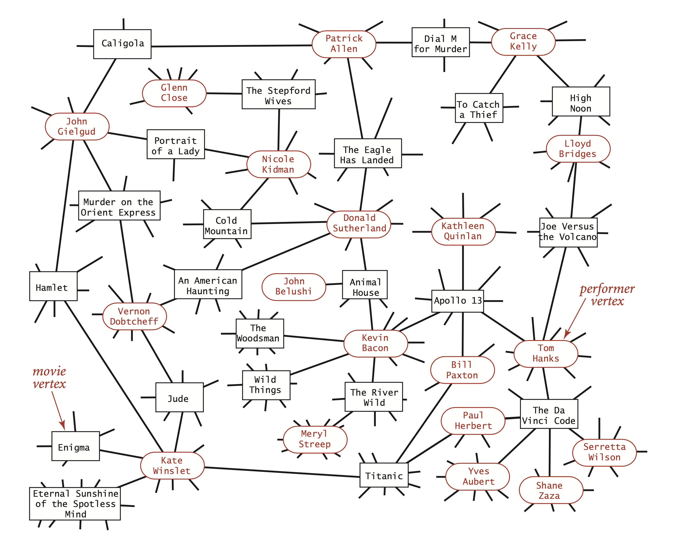

# Bipartite Graph

## Formal definition

- In the mathematical field of graph theory, a bipartite graph (or bigraph) is a graph whose vertices can be divided into two disjoint and independent sets [wiki](https://en.wikipedia.org/wiki/Bipartite_graph).

## Application

- Image we need a kind of data structure to store the relations between movies and actors: a movie has many actors, and an actor is possible to star in many movies. What kind of data structure do you apply to store the relation?

- As what we do is to store the mapping, the most simple way is to apply a hash table, so we could use the `HashMap<String, List<String>>` to store the mapping from movies to the actor list. Given the name of a movie, we will get all the actors starred in this movie quickly.

- But what do we do if we would like to get all the movies an actor stars in given his or her name? We need to apply inverted index, make some modification of the hash table, to build another hash table using the actors as the key and movie list as the value.

- For this example, we can apply the bipartite graph instead of the hash table. Relation between movies and actors is like a bipartite graph: we regard movies and actors as nodes in the graph, relation of acting the role as edges, thus there is only connections between actors and movies, and there is no case that an actor node connects to another actor node or a movie node connects to another movie node.

- By the definition of the bipartite graph, if we paint actor nodes and movie nodes, there must be a bipartite graph:

